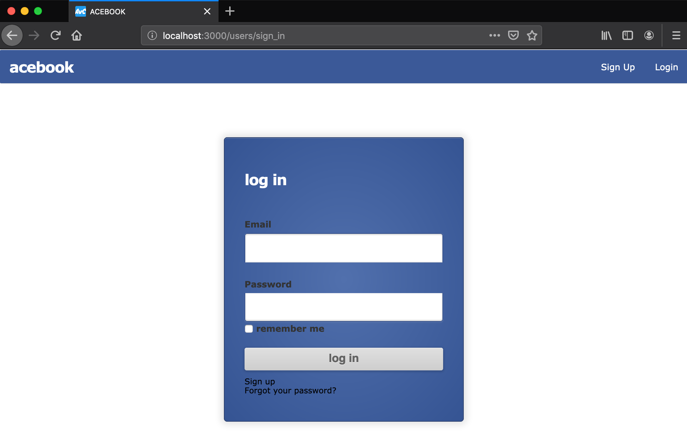

[](https://codeclimate.com/github/DanGyi23/acebook-rails-template-railz-rude-boiz/maintainability) [](https://codeclimate.com/github/DanGyi23/acebook-rails-template-railz-rude-boiz/test_coverage)
# Acebook - README

An original social networking application developed in rails

- [Link to LIVE Heroku App](https://mighty-woodland-36916.herokuapp.com/users/sign_in)
- [Link to ActiveStorage Blog Post](https://medium.com/@daniel.gyi/integrating-active-storage-with-your-existing-devise-framework-rails-bf9fc65a43c1)
- [Link to Daily Learnings/Planning doc](https://github.com/DanGyi23/acebook-rails-template-railz-rude-boiz/blob/master/Learning-WIKI/Railz-Rude-Boiz-Wiki.md)

We used a Trello board as a team of 4 to estimate work, plan sprints, and implement features. 

## Getting Started

These instructions will get you a copy of the project up and running on your local machine for development and testing purposes.

### Prerequisites

Ruby version 2.6.3 is used. To check which version of Ruby you have installed
```
$ ruby -v
```

Rails version 6.0.0 is used. To check which version of Rails you have installed
```
$ rails -v
```

### Technologies/Add-ons used


| Tech used        | What does it do?    | How we used it  |
| ---------------- |:-----------------------------:| ------------------:|
| Ruby ~> v2.6.3   | Backend, (MVC)      | In MVC layers   |
| Rails ~> v6.0.0  | Web App framework   | For exactly that|
| Devise           | Authentication for rails apps | Auth and tracking sessions                |
| ActiveStorage    | Stores files referentially                    | Storing uploaded user profile images                |
| ActiveRecord     | Built-in ORM for Rails                    | creating DB Migrations and creating/joining tables      |
| ImageMagick      | Image manipulating software           | Shrinking/editing images in-situ in views                |
| ActionCable      | Opens websockets to create persisted connection  | Built a live chat                |
| RSpec            | Ruby testing framework  | To test controllers/models                 |
| Capybara         | Feature testing framework  | To test features                |
| POSTGRESQL       | Database Management System | To store all of our data both locally and in production                |
| Travis           | CI Tool                    | To make sure pull requests weren't breaking our functionality     |
| Heroku           | App Hosting Service   | To deploy our app                |
| CodeClimate      | Code quality checking tool                    | Check maintainability/code coverage                 |
| Factory Bot      | Testing library |  Stubbing persistent data for testing purposes               |
| Bootstrap        | CSS Framework                    | Make it look PRETTY!                 |
| AWS Storage (S3) | Cloud Storage API                    | Permanently store uploaded images/files via our Heroku app   |
| JQuery           | Front-end JS Library    | Add front-end dynamic behaviour              |


### Installing

To get a development env running:

- Install ImageMagick to handle profile images in the program
```
$ sh -c "$(curl -fsSL https://raw.githubusercontent.com/Linuxbrew/install/master/install.sh)"  - brew install ImageMagick
```

- Download and install [PostGreSQL](https://www.postgresql.org/) if you don't already have it


- Install gems

```
$ bundle install
```

- Create local database with postgresql
```
$ rails db:migrate
```

- Start local server and visit localhost:3000 in browser to view Acebook homepage
```
$ rails server
```


